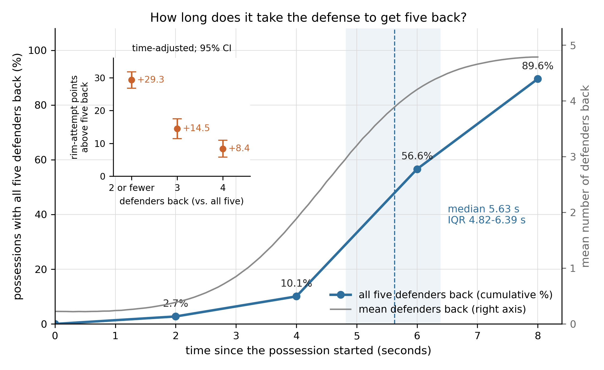
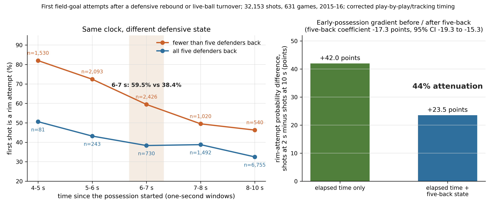

# Five Back: When Does Transition End?

Transition offense is usually indexed by elapsed possession time, yet elapsed time alone does not determine whether the defense has recovered. This repository measures defensive numerical recovery directly from player-tracking data in 631 NBA games from 2015-16 and separates it from elapsed possession time. It contains the analysis code, the analysis definitions, the aggregate results behind every reported number, and the two figures.

> This study uses historical 2015-16 public SportVU tracking and does not claim that numerical recovery times are unchanged in the current NBA.

## Research question

When a transition shot is taken, how many defenders have recovered across half court, and how much of the early-possession rim-access advantage is associated with that defensive state rather than with elapsed possession time?

All results below are **associations**, not causal effects. Nothing here identifies why any individual shot is taken.

## Prior work

Tracking-based work on transition defense quantified the trade-off between crashing the offensive glass and getting back: J. Wiens, G. Balakrishnan, J. Brooks and J. Guttag, "To Crash or Not To Crash: A quantitative look at the relationship between offensive rebounding and transition defense in the NBA," MIT Sloan Sports Analytics Conference, 2013. This repository measures defensive numerical recovery at the moment of the transition shot directly, complementing that trade-off analysis from the defensive side.

## Main findings

- **The recovery clock is slow and dispersed.** After a defensive rebound or live-ball turnover, the median time until all five defenders are back in their own half is **5.63 s** (IQR 4.82–6.39 s); **56.6 %** of possessions have five back by 6 s, and **10.4 %** still lack a fifth defender at 8 s.
- **Numerical recovery is associated with rim access.** Shooting with all five defenders back is associated with a **17.3 percentage-point lower probability of a rim attempt** (95 % CI −19.3 to −15.3), adjusting for elapsed possession time, start type, period and score margin, with standard errors clustered by game (32,153 first field-goal attempts, 631 games).
- **The state is not a relabeling of the clock.** Among shots taken 6–7 s into the possession, rim-attempt rates are **59.5 %** with fewer than five defenders back and **38.4 %** with five.
- **Clock versus defensive state.** Elapsed time alone implies a **42.0**-point rim-attempt difference between shots taken 2 s and 10 s into the possession; adding five-back status reduces that model-estimated gradient to **23.5** points — an attenuation of **44 %**, with **56 %** remaining.
- **Dose response.** Relative to five defenders back, rim-attempt probability is **+8.4** points with four back, **+14.5** with three, and **+29.3** with two or fewer.

Sources: `results/nback_validation.json` (recovery clock), `results/fiveback_results.json` (models, decomposition, dose response), `results/check1_common_support.json` (same-clock comparison). Every plotted value is traced to its result file in `docs/validation/FIGURE_VALUES.md`; the abstract is `docs/ABSTRACT.txt`.

## Definitions

| Term | Definition |
|---|---|
| `N_BACK` | Instantaneous numerical recovery state: how many of the five defenders are inside their own defensive half at a given tracking frame (0–5). |
| `FIVE_BACK` | Indicator that `N_BACK == 5`, evaluated one second before the shot. |
| `T5` | Time from the start of the possession until `N_BACK` first reaches 5 — the recovery clock. |
| `RIM_ATTEMPT` | Field-goal attempt taken within 4 ft of the basket; the primary outcome. |

Possessions begin with a defensive rebound or a live-ball turnover, and the analysis unit is the **first** field-goal attempt of such a possession. Exact rules, thresholds and exclusions are specified in `configs/analysis_definitions.yaml` and `configs/final_adversarial_checks.yaml`.

## Reproducing the results

Two stages, described in full in `docs/REPRODUCIBILITY.md`.

**A. From the shipped aggregates — no tracking data required.** Every number in the abstract, in this README and in both figures is reproducible from `results/*.json`:

```bash
pip install -r requirements.txt
python3 tests/test_smoke.py      # regenerates both figures, asserts the headline numbers
```

**B. Full reconstruction from the public sources — requires independently obtained third-party data.** Place the SportVU JSON files and the play-by-play table where the pipeline expects them (or set `FIVEBACK_SPORTVU_JSON` and `FIVEBACK_PBP`), then:

```bash
bash scripts/run_all.sh
```

This rebuilds the withheld possession and shot tables locally, validates the `N_BACK` construct, fits the models, runs the three pre-specified robustness checks, and re-renders the figures. Each analysis rule was fixed before the corresponding numbers were computed. A verification run of both stages is recorded in `docs/FRESH_CLONE_TEST.md`.

## Data availability

Raw tracking and play-by-play data are **not redistributed** in this repository. Provided instead: the exact public sources and how to obtain them, the complete code and the analysis configuration, legally releasable aggregate results, and deterministic reconstruction instructions. Details, including which derived tables are withheld and why, are in `docs/DATA_AVAILABILITY.md` and `docs/PROVENANCE.md`.

## Repository structure

```
src/        analysis producers (build, validate, analyze, robustness checks, figures) and self-contained tracking readers
configs/    analysis definitions and the game universe (ids and source file stems)
scripts/    run_all.sh — the end-to-end path from user-supplied source data
results/    aggregate results in JSON (no player-, shot- or frame-level rows)
figures/    the two figures (PDF + 300-dpi PNG) with captions
docs/       abstract, data availability, reproducibility, provenance, limitations, validation/
tests/      smoke test: aggregates to figures, with headline assertions
data/       reference/ basket-side metadata; external/ is where user-supplied source data go (empty here)
```

## Figures

**Figure 1 — the recovery clock.** Cumulative share of possessions with all five defenders back, by time since the possession began, with the time-adjusted dose response by number of defenders back (inset).



**Figure 2 — same clock, different defensive state.** Rim-attempt rate in one-second bins of elapsed possession time, split by whether all five defenders were back, and the early-possession gradient before and after accounting for five-back status.



Full captions: `figures/FIG1_caption.txt`, `figures/FIG2_caption.txt`.

## Limitations

- One historical NBA season, from a public historical tracking corpus.
- Observational associations only; no causal claim, and no identification of why a given shot is taken.
- `FIVE_BACK` measures half-court **numerical** recovery. Five defenders back is not the same as a set defense: it says nothing about matchups, rim protection or defensive organisation, and 56 % of the elapsed-time gradient remains unexplained here.
- The analysis conditions on possessions that reach a first field-goal attempt; the selection analysis finds only minor differential inclusion (+2.3 pp).

Full text: `docs/LIMITATIONS.md`.

## License

Code in this repository is released under the MIT License (see `LICENSE`). The license does not cover third-party data (SportVU tracking, stats.nba.com play-by-play), which are not included here.
